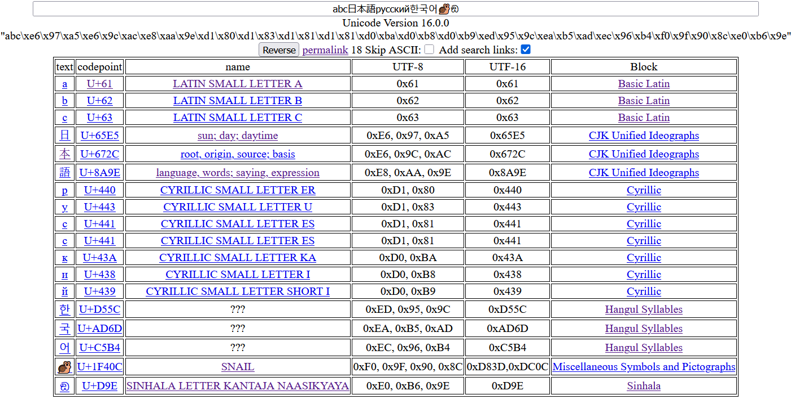

# Unicode Analyze Page

A simple website where you type in a string and get a list of all Unicode characters in it,
their name, value and UTF-8 encoding.

It also displays meaning of CJK characters from the Unihan database, but this is **not** a translator.
No web requests past the original one for the page and data JSON, updates in real time.

To see it in action go to [https://frex.github.io/unicode.html](https://frex.github.io/unicode.html).

To deploy this tool yoursef you need the two files:
1. `index.html` - the HTML with input box and inline JS to analyze the string.
2. `data.js` - the data as JSON, generated from `UCD.zip` and `Unihan.zip` files.

Both files and the `gendata.py` script that generates `data.js` are in this repo.

To get the `UCD.zip` and `Unihan.zip` files, visit
[https://www.unicode.org/Public/UCD/latest/ucd/](https://www.unicode.org/Public/UCD/latest/ucd/).

You don't need to unpack them, just drop them in same directory as `gendata.py`
and run it, to generate `data.js`. The meaning of CJK characters is taken from `kDefinition` field.

Other tools to deal with Unicode strings, analyze them, convert them, etc.:
1. [https://www.fontspace.com/unicode/analyzer](https://www.fontspace.com/unicode/analyzer) - updates
in real time, but the first time character appears it takes a split second to load its info. It also
only lists the codepoint of CJK characters, but not their meanings. Provides the link with your input
prefilled but it's not plaintext in the URL. Does a request for every update.
2. [https://unicodemap.org/search.asp](https://unicodemap.org/search.asp) - limit of 1000 characters,
splits BMP characters (e.g. emojis) into surrogate pairs, doesn't update in real time, has no
CJK character meaning. Provides a link with your input prefilled.
3. [https://devina.io/unicode-analyser](https://devina.io/unicode-analyser) - updates in real time,
has more info than just codepoint values, fast, but still no CJK meaning data. No way to make a link
that leads to this page and has prefilled input.
4. [https://freetools.textmagic.com/unicode-detector](https://freetools.textmagic.com/unicode-detector) - updates
in real time, shows you what characters might cause problems and be encoded in longer encodings in SMS text messages.
5. [https://www.soscisurvey.de/tools/view-chars.php](https://www.soscisurvey.de/tools/view-chars.php) - requires
a click to execute, shows non-printable characters hidden in the string, but nothing else.
6. [https://www.fileformat.info/info/unicode/char/search.htm](https://www.fileformat.info/info/unicode/char/search.htm) - requires a click to excute, can only search one character a time it seems. **Includes CJK meaning**.
7. [https://r12a.github.io/app-analysestring/index.html](https://r12a.github.io/app-analysestring/index.html) - requires a click to execute, and does web request to get high res picture of non-CJK characters. **No CJK meaning, but for CJK provides Unihan Unicode database link, which has this and other information.**
8. [https://chrome.google.com/webstore/detail/unicode-analyzer/pipjflhdnjcdflbkmoldkkpphmhcfaio](https://chrome.google.com/webstore/detail/unicode-analyzer/pipjflhdnjcdflbkmoldkkpphmhcfaio) - Chrome extension, lots of information provided on the
tab that opens for analysis, convenient for existing web page, but to analyze own string you need to edit the URL or get
it typed into some input box on another website first. No CJK meaning.
9. [https://www.branah.com/unicode-converter](https://www.branah.com/unicode-converter) - no character information or CJK
meaning, but converts given string in realtime to many UTF- encodings, big and little endian, percent encoding, etc.
